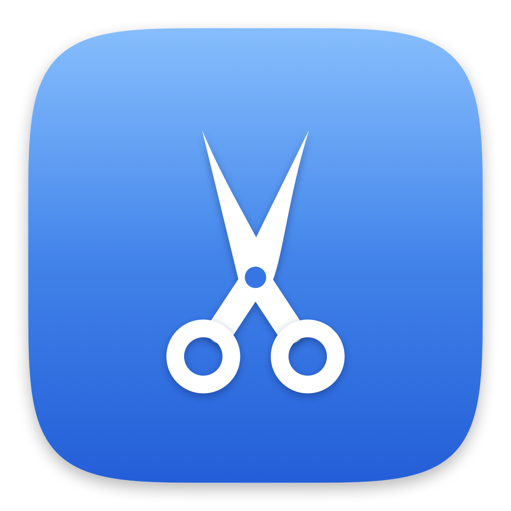

<div align="center">



# CutX

**Cut and paste files in Finder, the way you expect.**

Press <kbd>⌘X</kbd> on a file or folder, then <kbd>⌘V</kbd> where you want it.
The items move — they are removed from the original location, exactly like Windows.

Free, open source, no ads, no tracking.

[Download](https://github.com/helalrules7/cutx/releases) ·
[Buy me a coffee ☕](https://buymeacoffee.com/ahmedhelal)

</div>

---

## Why

macOS has no cut for files. Finder's <kbd>⌘X</kbd> is permanently greyed out, and
the real move gesture is <kbd>⌘C</kbd> followed by <kbd>⌥⌘V</kbd> — which almost
nobody knows about, and which your fingers will not learn if they grew up on
Windows.

CutX makes the obvious shortcut do the obvious thing.

## How it works

**CutX never touches your files. It asks Finder to do the move.**

On <kbd>⌘X</kbd> it forwards a copy to Finder and remembers what you marked. On
<kbd>⌘V</kbd> it forwards Finder's own **Move Item Here**. That means undo
(<kbd>⌘Z</kbd>), the progress window for large transfers, the Replace / Keep Both
dialog, authentication for protected folders, and permission preservation all work
exactly as they normally do — because it really is Finder doing the work.

Outside Finder, CutX is invisible. <kbd>⌘X</kbd> in your editor cuts text, as
always. That guarantee is the most heavily tested part of the codebase.

## Install

1. Download `CutX.zip` from [Releases](https://github.com/helalrules7/cutx/releases).
2. Unzip and drag **CutX.app** to Applications.
3. Open it. It lives in the menu bar — no Dock icon, no window on launch.
4. Grant the two permissions it asks for. The setup screen shows a live checklist
   and walks you through it; rows turn green the moment you flip the switch.

Requires macOS 13 or later. Signed and notarized by Apple, so it opens with one
click.

## Settings

Left-click the scissors in the menu bar to open the window.

| Tab | What's in it |
|---|---|
| **General** | Whether CutX is active, the permission checklist, `Also use ⌃X`, `Show cut indicator`, `Launch at login` |
| **Sounds** | On/off, volume, and six cut sounds with a ▶ on every row |
| **About** | Version, links, and the coffee button |

Right-click the icon for a short menu: what's currently cut, Clear, Open, and Quit.

## What it does not do

- **It does not dim the cut files inside the Finder window.** macOS exposes no API
  for that — the greyed-out look in Windows is part of Explorer itself. The
  menu-bar badge and the on-screen indicator are the honest alternative.
- It does not work in third-party file browsers or Open/Save dialogs.
- Pasting into a non-Finder app copies rather than moves. This is deliberate — it
  is the safe direction to fail in.

## Build from source

```bash
git clone https://github.com/helalrules7/cutx.git
cd cutx
./scripts/test.sh        # decision logic — 31 tests
./scripts/build-app.sh   # produces dist/CutX.app
```

`python3 scripts/make-sounds.py` regenerates every file in `Resources/sounds/`, and
`./scripts/make-icon.sh` regenerates the app icon.

Releases are produced by `./scripts/sign-and-notarize.sh`, which needs a Developer
ID certificate and a notarytool keychain profile.

Before tagging a release, work through
[docs/manual-testing.md](docs/manual-testing.md).

### How the code is arranged

Everything that can be tested without a keyboard, a Finder, or a granted permission
lives in `Sources/CutXCore`. `Sources/CutX` is the thin, untestable shell around it.

The whole behavior of the app funnels through one pure function:

```swift
func decide(event: KeyEvent, context: Context) -> Decision   // .passThrough | .cut | .paste
```

When anything is uncertain the answer is `.passThrough`. A key that behaves
normally is always better than a key that surprises you.

## Support

CutX is free and always will be. If it saves you some clicks:

☕ **[buymeacoffee.com/ahmedhelal](https://buymeacoffee.com/ahmedhelal)**

## License

MIT — see [LICENSE](LICENSE). Bundled sound credits are in
[ATTRIBUTIONS.md](ATTRIBUTIONS.md).

Made by [Ahmed Helal](https://github.com/helalrules7).
